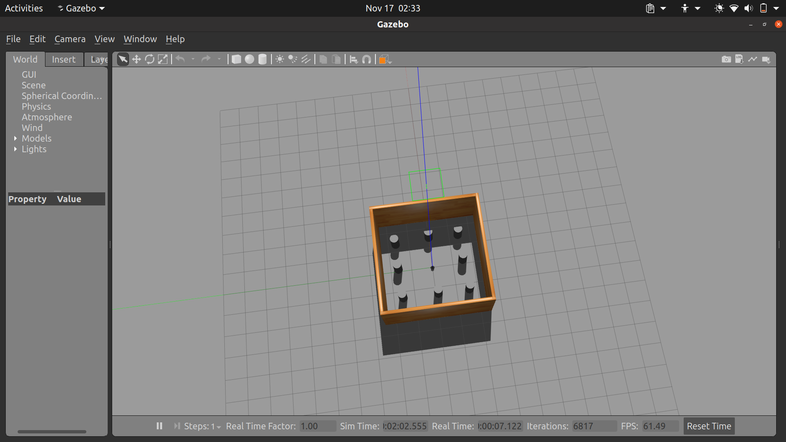

# Differential Drive Robot for EKF SLAM and Outdoor Navigation 🚀🤖

## Overview
This repository contains a complete solution for **building, simulating, and navigating a differential drive robot**. It covers several key robotics concepts, such as **EKF-based SLAM (Simultaneous Localization and Mapping)**, **outdoor navigation**, and practical designs using **SolidWorks files**. The project integrates both hardware and software components necessary to develop and test mobile robotics systems.

---

## Repository Contents

### 1. EKF Localization and SLAM Algorithms  
- **Extended Kalman Filter (EKF) Localization**:
  - A Python-based ROS node for **localizing a differential drive robot** using **odometry, LiDAR data, and landmarks**.
  - Includes **data association** and **uncertainty modeling** to handle sensor noise and maintain accurate pose estimation.
  - Supports visualization in **RViz** for:
    - Robot pose
    - Detected objects (cylinders)
    - Error ellipses for covariance visualization  


- **EKF SLAM**:
  - Implements **SLAM (Simultaneous Localization and Mapping)** for mapping an environment and localizing the robot within it.
  - Uses **odometry, LiDAR, and landmarks** to incrementally build a map and track the robot’s pose.

---

### 2. Outdoor Navigation for Differential Drive Robot  
- Path planning and control for **outdoor environments** using a **custom motion planning algorithm**.
- Employs **costmaps** for obstacle avoidance and ensures smooth path generation.
- Configured for **TurtleBot3** and customizable for other differential drive platforms.

---

### 3. Simulation Setup in Gazebo  
- Simulation environments containing landmarks, obstacles, and **outdoor scenarios**.
- **TurtleBot3 robot model** is configured to work with EKF-based localization and SLAM.
- Easily extensible to other **differential drive robots**.

---

### 4. SolidWorks CAD Models  
- CAD models of a **custom differential drive robot** in **SolidWorks**.
- Includes:
  - **Chassis design**
  - **Wheel configurations**
  - **Sensor mounts for LiDAR and cameras**  
- Models can be used to build the physical robot.

---

### 5. ROS Package Setup and Code  
- Includes **ROS nodes and launch files** to easily run the simulations and real-world navigation tasks.
- Topics used:
  - `/odom`: Odometry data from robot
  - `/scan`: LiDAR scans for SLAM and obstacle detection
  - `/cmd_vel`: Velocity commands for robot movement  
- **Launch files**:
  - Launch Gazebo simulations with pre-configured environments.
  - Start EKF SLAM and navigation nodes with a single command.

---

## How to Use This Repository

1. **Clone the Repository**:
   ```bash
   git clone https://github.com/Devam-032/EKF_Localisation.git
   cd EKF_Localisation
   ```

2. **Run EKF Localization Node**:
   ```bash
   roslaunch ekf_localization ekf_localization.launch
   ```

3. **Run SLAM and Navigation**:
   ```bash
   roslaunch outdoor_navigation slam_navigation.launch
   ```

4. **Visualize in RViz**:
   - Use the provided **RViz configuration** files to see:
     - Robot pose
     - Map being built in real-time
     - Planned path and obstacles

---

## Required Tools and Dependencies  
1. **ROS (Robot Operating System)** - Recommended: **ROS Noetic**
2. **Gazebo Simulator**
3. **Python 3.x** with `numpy`, `rospy`, and other ROS packages.
4. **SolidWorks** or any CAD viewer for accessing the mechanical designs.
5. **TurtleBot3 Simulation Package** (for testing with TurtleBot3).

---

## Directory Structure
```
EKF_Localisation/
│
├── ekf_localization/          # EKF Localization scripts
│   ├── scripts/
│   │   └── ekf_localization.py
│   └── launch/
│       └── ekf_localization.launch
│
├── ekf_slam/                 # EKF SLAM scripts
│   ├── scripts/
│   │   └── EKF_SLAM.py
│   └── launch/
│       └── ekf_localization.launch
│
├── outdoor_navigation/        # Navigation and path planning scripts
│   ├── launch/
│   └── config/
│
├── solidworks_models/         # SolidWorks CAD files for the robot
│   └── robot_assembly.SLDASM
│   └── parts/
│
├── rviz_configs/              # RViz configurations for visualization
│
├── README.md                  # Documentation for the project
└── LICENSE                    # License for the repository
```

---

## Future Improvements
- Adding **sensor fusion** with IMU and GPS for enhanced localization in outdoor environments.
- **Hardware implementation** of the robot design using Raspberry Pi or Jetson Nano.
- Support for **multi-robot systems** with collaborative SLAM.

---

## Contributing
Contributions are welcome! If you'd like to improve the code, fix bugs, or add new features, feel free to create a **pull request**.

---

## License
This project is licensed under the **MIT License**. See the `LICENSE` file for details.

---

## Contact
For any questions or issues, feel free to reach out:

- **Devam Shah**: devamshah008@gmail.com  
- [LinkedIn Profile](https://www.linkedin.com/in/devam-shah-0a8918227)
